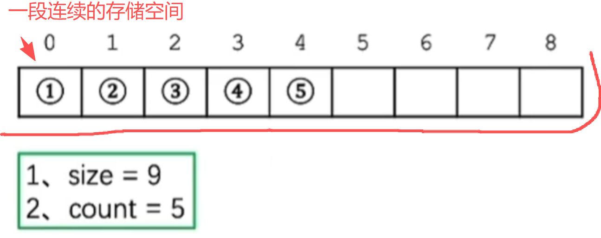

# 结构定义

> **注意!**
>
> 此文章的所有代码，为C语言与C++混用，后续会全部改为用C++的形式实现，同时给出多个版本的实现，如原始C语言的方式和现代C++的实现方式。


顺序表，最简单数据结构之一，由一片连续的存储空间和size与count组成。



`Size`:这个表的大小。

`Count`：这个表内元素的数量。


```c++
typedef struct Vector {
    int size,count; //大小，存储元素的数量
    int* data;// 连续存储区
} Vector;
```


# 结构操作

## 初始化

初始化的时候，我们首先需要开辟这个数据结构的内存空间，然后再开辟内部成员的内存空间。

```c++
Vector* Init_Vector(int _size){
    Vector* v = (Vector*)malloc(sizeof(Vector));
    v->size = _size;
    v->count = 0;
    v->data = (int*)malloc(sizeof(int) * _size);
    return v;
}
```

## 销毁

有创建就有摧毁，销毁这个数据结构时，由内向外进行销毁。

```c++
void Clear(Vector* v){
    if(v == NULL) return ;
    delete v->data;
    delete v;
    return ;
}
```

## 插入元素

插入操作，就是在这篇连续存储空间上插入一个元素。
插入前需检查一下插入位置是否可插入（就是这个位置合不合法）。
如果合法，就让插入位置后面的元素都向后移动一位，空出插入位置。


记得要从连续存储空间的末尾向前遍历移动元素，如果是从前向后（或者从插入位置）遍历，则前面的元素会覆盖掉后面的元素，造成元素丢失。

遍历移动完成后就可以插入元素了，同时记得更新count属性。

```c++
bool Insert(Vector* v, int _pos, int _val) {
    if (_pos < 0 || _pos > v->size) return 0;
    
    if (v->count == v->size && !Expand(v))  return 0;
	//此处的Expand为扩容操作
    

    for (int i = v->count - 1;i >= _pos;i--) {
        v->data[i + 1] = v->data[i];
    }
    v->data[_pos] = _val;
    v->count++;
    return 1;
}
```

## 删除元素

既然可以指定插入，也就可以指定删除。
事前检查一下删除位置是否合法。
然后从删除位置开始遍历即可，将后面的元素向前移动一位，覆盖掉前面的元素。

同时记得更新属性。

```c++
bool Delete(Vector* v,int _pos){
     if(_pos < 0 || _pos > v->size) return 0; 

     for(int i= _pos;i < v->count - 1;i++){
        v->data[i] = v->data[i + 1];
     }
     v->count--;
     return 1;
}
```

## 扩容

有了插入和删除，自然还需要添加一个扩容操作。
扩容前要检查顺序表的合法性。

使用2倍扩容法，即size * 2,扩容后记得更新属性。

```c++
int Expand(Vector* v) {
    if (v == NULL) return 0;

    std::cout << "触发扩容操作!" << std::endl;

    int* ptr = (int*)realloc(v->data, sizeof(int) * 2 * v->size);

    if (ptr == NULL) return 0;

    v->data = ptr;
    v->size *= 2;
    PrintVector(v);
    return 1;
}
```

上述的Expand是C语言与C++的混合实现，如果是纯C++的实现方式，为:

```c++
bool Vector::Expand(){
    int* ptr = new int[this->_size*2];
    if (ptr == NULL) return 0;

    //for(int i =0;i < this->_count;i++) ptr[i] = this->_data[i];
    std::copy(_data,_data + _count,ptr);//效果同上

    delete[] this->_data;
    this->_data = ptr;
    this->_size *= 2;
    return 1;
}
```

嗯，很麻烦，不如C语言的relloc来的实在和简便。

在C++中实现relloc函数和调用:

```c++
template<typename T>
T* smart_relloc(T* old_ptr, size_t old_count, size_t new_count){
    static_assert(std::is_trivially_copyable_v<T>,
        "Type must be trivially copyable for realloc");

    T* new_ptr = static_cast<T*>(std::realloc(old_ptr, new_count * sizeof(T)));
    if (!new_ptr) {
        // 回退：重新分配并手动拷贝
        new_ptr = static_cast<T*>(std::malloc(new_count * sizeof(T)));
        if (!new_ptr) return nullptr;

        std::memcpy(new_ptr, old_ptr, old_count * sizeof(T));
        std::free(old_ptr);
    }
    return new_ptr;
}

bool Vector::Expand_New(){
    
    int* ptr = smart_relloc(_data,_count,_size * 2);
    if(ptr ==NULL) return 0;
    this->_data = ptr;
    this->_size *= 2;
    return 1;
}
```

